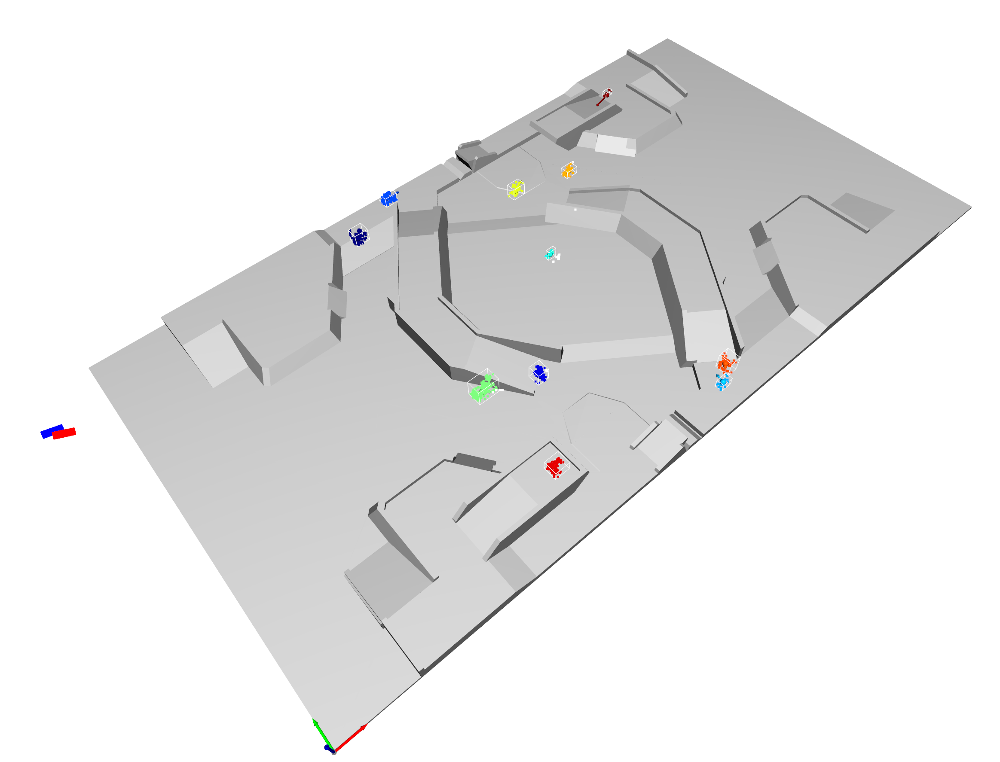

# PointCloudDetection

RoboMaster 2023 哈尔滨工业大学（深圳） 南工骁鹰战队 雷达站点云定位



## 项目设计

点云定位系统的设计目标，是作为雷达站确定场上运动目标的第一层检测，为后续的目标识别提供位置信息，同时借助其获取的丰富三维信息，进行目标预测从而保证跟踪的连续性。

## 项目优势

相比上海交通大学在 2021 赛季开源的雷达站代码 [COMoER/LCR_sjtu](https://github.com/COMoER/LCR_sjtu) 相比，我们采用基于点云的目标检测与跟踪，具有视觉识别所不具有的高灵敏性以及不全可见目标的检测能力。与此同时，我们的处理效率更为高效，在正常赛场条件下可实现 500Hz 以上[^1]的处理速度，保证了雷达站的实时性。

## 项目架构

```
main.cpp                    主程序 *核心*
config.yaml                 配置文件
config.sample.yaml          样例配置文件
default.yaml                默认配置文件

Clustering.h/.cpp           聚类算法
Config.h                    配置读取
KalmanFilter.h/.cpp         卡尔曼滤波
PcReceiver.h/_**.cpp        点云接收
Recorder.h/.cpp             内录程序
TargetMap.h/.cpp            目标跟踪 *核心*
Transform.h/.cpp            坐标变换处理
VisualizerHelper.h/_**.cpp  可视化相关
VoxelGrid.h/.cpp            点云体素化 *核心*
```

## 通讯协议

本项目兼容 Livox 激光雷达的通讯协议。

在发送数据时，我们使用了 MQTT 协议，以保证数据的实时性。

定位结果数据结构（发送于主题 `pc_detected` ）：

```json
{
    "enemies": [
        {
            "id": uint,
            "position": [float, float, float],
            "velocity": [float, float, float],
            "is_predict": bool,
            "lost_time": uint,
            "is_discarded": bool
        }
    ]
}
```

## 部署方式

### 安装依赖

以 Ubuntu 22.04 作为部署环境，兼容 ArchLinux 等发行版。

```bash
sudo apt install libeigen3-dev libspdlog-dev libyaml-cpp-dev nlohmann-json3-dev libboost-dev libtbb-dev libpaho-mqttpp-dev
```

### 编译安装 [Open3D](https://github.com/isl-org/Open3D)

推荐编译选项：减少无用组件编译，使用系统 `fmt` 解决 Ubuntu 22.04 的部署问题

```bash
git clone https://github.com/isl-org/Open3D && cd Open3D
util/install_deps_ubuntu.sh
mkdir build && cd build
cmake -DBUNDLE_OPEN3D_ML=OFF -DBUILD_UNIT_TESTS=OFF -DWITH_OPENMP=ON -DBUILD_PYTHON_MODULE=OFF -DBUILD_EXAMPLES=OFF -DUSE_SYSTEM_FMT=ON -DGLIBCXX_USE_CXX11_ABI=1 ..
make -j$(nproc)
sudo make install
```

### 推荐编译方式

使用 Intel oneAPI ICX 编译器获得最佳性能

[^1]: 在一台搭载 i7-12700H 处理器的笔记本上，开启 `-O3` 优化选项，使用 `icx` 编译器编译，于读取 PCD 文件的模式下达成。实际运行受到激光雷达速度限制，能达到稳定 49Hz 的处理速率。
